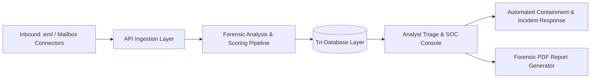
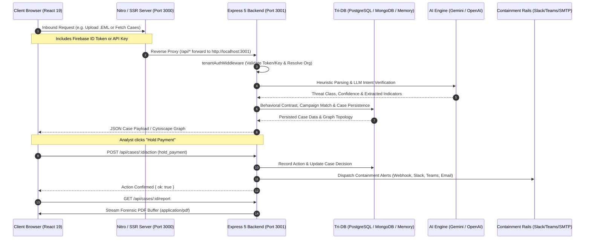
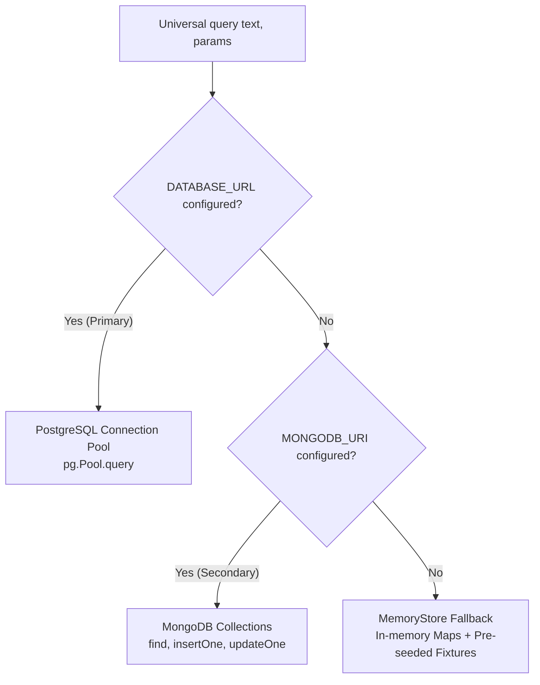
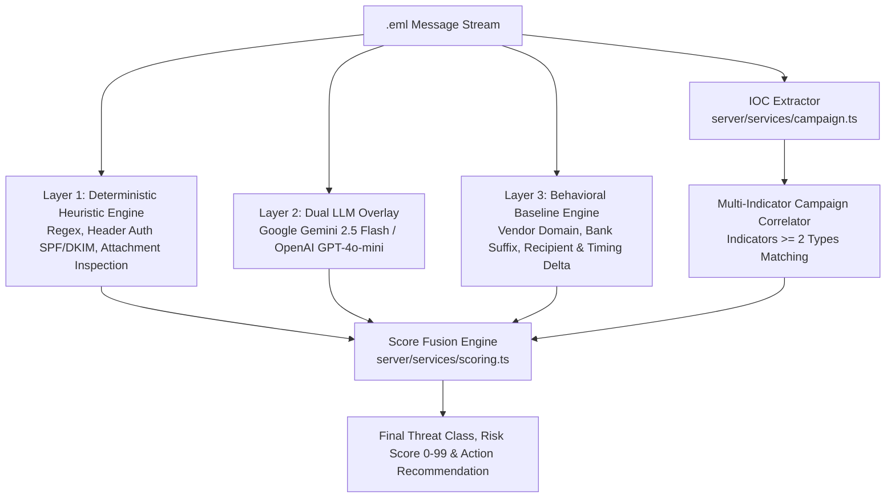
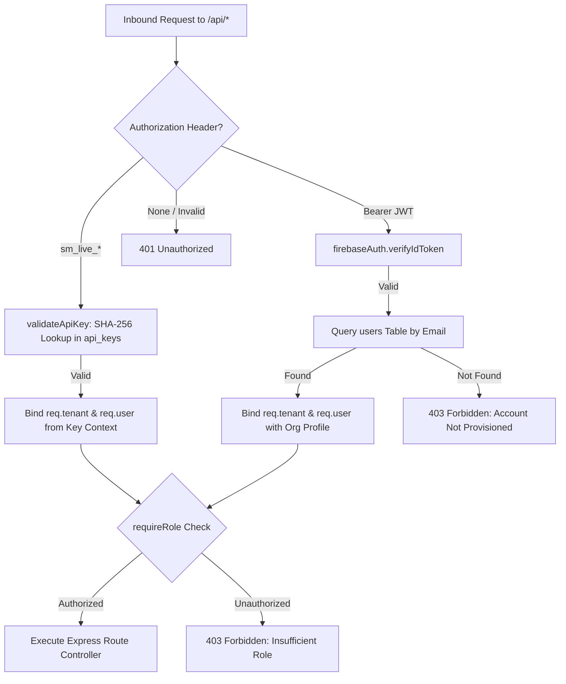
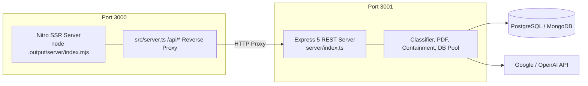

# SentinelMail System Architecture

This document describes the implemented architecture of SentinelMail, reflecting the current state of both the frontend application and the Express 5 backend services.

---

## 1. High-Level Overview

SentinelMail is an enterprise Business Email Compromise (BEC) investigation and financial containment platform designed for corporate finance, accounts payable (AP), and Security Operations Center (SOC) teams. The platform analyzes inbound RFC 822 (`.eml`) messages to detect invoice fraud, executive impersonation, wire diversion attempts, credential phishing, and malware delivery.

### Core Capabilities

- **Inbound Forensic Ingestion**: Multipart `.eml` upload via [`POST /api/analyze`](file:///c:/Users/dsaro/Downloads/Sentinel-Mail-updated/Sentinel-Mail-main/server/routes/analyze.ts#L38-L335) or automated mailbox connectors ([`server/routes/ingest.js`](file:///c:/Users/dsaro/Downloads/Sentinel-Mail-updated/Sentinel-Mail-main/server/routes/ingest.js)) for Microsoft 365 and Google Workspace.
- **Multi-Layer Threat Classification**: Deterministic regex-based heuristics coupled with an LLM overlay (Google Gemini 2.5 Flash / OpenAI GPT-4o-mini).
- **Behavioral Baselining**: Vendor deviation tracking against historical sending domains, known contacts, approved bank account suffixes, and normal recipients.
- **Score Fusion**: Mathematical score arbitration merging rule scores, behavioral deltas, AI confidence modifiers, and threat campaign correlation into a 0–99 severity scale.
- **Automated Campaign Correlation**: Graph-based multi-indicator IOC clustering that correlates cases sharing two or more distinct indicator types.
- **Immediate Containment**: One-click AP payment holds with automated alert dispatch across Webhooks, Slack, Microsoft Teams, and SMTP email.
- **Forensic PDF Incident Reports**: Audit-ready vector graphic PDF generation powered by [`pdfkit`](file:///c:/Users/dsaro/Downloads/Sentinel-Mail-updated/Sentinel-Mail-main/server/services/pdf-report.ts).
- **Enterprise Multi-Tenancy & RBAC**: Organization data isolation, Firebase Admin token verification, cryptographic API key authentication, and role-based access control.

---

## 2. Tech Stack (Frontend + Backend)

SentinelMail is structured as a decoupled full-stack architecture comprising a React 19 SSR frontend and an Express 5 REST API backend.

| Layer                     | Technology                         | Primary Dependencies                                                       | Source Location                                                                                                                                                                                                                                                        |
| :------------------------ | :--------------------------------- | :------------------------------------------------------------------------- | :--------------------------------------------------------------------------------------------------------------------------------------------------------------------------------------------------------------------------------------------------------------------- |
| **Frontend UI**           | React 19                           | `react`, `react-dom`, `@radix-ui/react-*`, `lucide-react`, `framer-motion` | [`src/`](file:///c:/Users/dsaro/Downloads/Sentinel-Mail-updated/Sentinel-Mail-main/src)                                                                                                                                                                                |
| **Routing & SSR**         | TanStack Router / TanStack Start   | `@tanstack/react-router`, `@tanstack/react-start`                          | [`src/router.tsx`](file:///c:/Users/dsaro/Downloads/Sentinel-Mail-updated/Sentinel-Mail-main/src/router.tsx), [`src/server.ts`](file:///c:/Users/dsaro/Downloads/Sentinel-Mail-updated/Sentinel-Mail-main/src/server.ts)                                               |
| **Data Fetching**         | TanStack Query                     | `@tanstack/react-query`                                                    | [`src/lib/api.ts`](file:///c:/Users/dsaro/Downloads/Sentinel-Mail-updated/Sentinel-Mail-main/src/lib/api.ts)                                                                                                                                                           |
| **Styling**               | Tailwind CSS v4                    | `@tailwindcss/vite`, `tailwindcss`                                         | [`src/styles.css`](file:///c:/Users/dsaro/Downloads/Sentinel-Mail-updated/Sentinel-Mail-main/src/styles.css)                                                                                                                                                           |
| **Build & Dev Server**    | Vite 8 + Nitro                     | `vite`, `nitro`, `@vitejs/plugin-react`                                    | [`vite.config.ts`](file:///c:/Users/dsaro/Downloads/Sentinel-Mail-updated/Sentinel-Mail-main/vite.config.ts)                                                                                                                                                           |
| **Backend API Server**    | Express 5                          | `express`, `cors`, `multer`                                                | [`server/index.ts`](file:///c:/Users/dsaro/Downloads/Sentinel-Mail-updated/Sentinel-Mail-main/server/index.ts)                                                                                                                                                         |
| **Runtime & Execution**   | Node.js (ESM)                      | `tsx`                                                                      | [`package.json`](file:///c:/Users/dsaro/Downloads/Sentinel-Mail-updated/Sentinel-Mail-main/package.json)                                                                                                                                                               |
| **Database Layer**        | PostgreSQL / MongoDB / MemoryStore | `pg`, `mongodb`                                                            | [`server/db/connection.ts`](file:///c:/Users/dsaro/Downloads/Sentinel-Mail-updated/Sentinel-Mail-main/server/db/connection.ts), [`server/db/mongo.ts`](file:///c:/Users/dsaro/Downloads/Sentinel-Mail-updated/Sentinel-Mail-main/server/db/mongo.ts)                   |
| **AI Classification**     | Google Gemini / OpenAI GPT-4o-mini | `openai`, Google Gemini REST API                                           | [`server/services/classifier.ts`](file:///c:/Users/dsaro/Downloads/Sentinel-Mail-updated/Sentinel-Mail-main/server/services/classifier.ts)                                                                                                                             |
| **PDF Reporting**         | PDFKit                             | `pdfkit` (745 lines custom layout engine)                                  | [`server/services/pdf-report.ts`](file:///c:/Users/dsaro/Downloads/Sentinel-Mail-updated/Sentinel-Mail-main/server/services/pdf-report.ts)                                                                                                                             |
| **Containment Alerts**    | Multi-channel dispatch             | `nodemailer`, HTTPS Webhooks                                               | [`server/services/containment.ts`](file:///c:/Users/dsaro/Downloads/Sentinel-Mail-updated/Sentinel-Mail-main/server/services/containment.ts)                                                                                                                           |
| **Authentication & RBAC** | Firebase Admin + API Keys          | `firebase`, `firebase-admin`                                               | [`server/middleware/auth.js`](file:///c:/Users/dsaro/Downloads/Sentinel-Mail-updated/Sentinel-Mail-main/server/middleware/auth.js), [`server/services/tenant.js`](file:///c:/Users/dsaro/Downloads/Sentinel-Mail-updated/Sentinel-Mail-main/server/services/tenant.js) |

---

## 3. Data Flow & Execution Environment

### Request Flow Details

1. **Client Request & Authentication**:
   - The frontend API client in [`src/lib/api.ts`](file:///c:/Users/dsaro/Downloads/Sentinel-Mail-updated/Sentinel-Mail-main/src/lib/api.ts#L44-L52) automatically extracts the current Firebase authentication token via `firebaseAuth.currentUser.getIdToken()` and attaches it as `Authorization: Bearer <token>`.
2. **Reverse Proxying**:
   - **Development**: The Vite dev server proxies all `/api/*` calls directly to `http://localhost:3001` via `server.proxy` configured in [`vite.config.ts`](file:///c:/Users/dsaro/Downloads/Sentinel-Mail-updated/Sentinel-Mail-main/vite.config.ts#L24-L29).
   - **Production / SSR**: The Nitro entry point in [`src/server.ts`](file:///c:/Users/dsaro/Downloads/Sentinel-Mail-updated/Sentinel-Mail-main/src/server.ts#L50-L79) intercepts incoming requests matching `/api/*` and proxies them using native `fetch` to `http://localhost:3001`. If the Express backend is unreachable, it returns HTTP 502 with diagnostic information.
3. **Authentication & Multi-Tenant Resolution**:
   - Express applies [`tenantAuthMiddleware`](file:///c:/Users/dsaro/Downloads/Sentinel-Mail-updated/Sentinel-Mail-main/server/middleware/auth.js#L15-L134) across all `/api` routes. It validates either an `sm_live_` API key or a Firebase ID token via [`firebaseAuth.verifyIdToken`](file:///c:/Users/dsaro/Downloads/Sentinel-Mail-updated/Sentinel-Mail-main/server/services/firebase-admin.js#L18), verifies tenant provisioning, and binds `req.tenant` and `req.user` to the request.
4. **Forensic Execution & Score Fusion**:
   - [`router.post("/api/analyze")`](file:///c:/Users/dsaro/Downloads/Sentinel-Mail-updated/Sentinel-Mail-main/server/routes/analyze.ts#L38) processes `.eml` uploads using Multer in-memory storage, runs rule-based parsing, queries vendor baselines, invokes the AI overlay, fuses risk scores, clusters campaigns, and commits records to the database.
5. **Report Generation & Containment**:
   - Triage actions trigger [`sendContainmentAlert`](file:///c:/Users/dsaro/Downloads/Sentinel-Mail-updated/Sentinel-Mail-main/server/services/containment.ts#L7-L200) without blocking the HTTP response. Requests to [`GET /api/cases/:id/report`](file:///c:/Users/dsaro/Downloads/Sentinel-Mail-updated/Sentinel-Mail-main/server/routes/cases.ts#L184-L240) stream vector PDFs generated by [`generateForensicPdf`](file:///c:/Users/dsaro/Downloads/Sentinel-Mail-updated/Sentinel-Mail-main/server/services/pdf-report.ts#L4-L745).

---

## 4. Database Layer

SentinelMail implements an adaptable tri-database storage abstraction in [`server/db/connection.ts`](file:///c:/Users/dsaro/Downloads/Sentinel-Mail-updated/Sentinel-Mail-main/server/db/connection.ts) and [`server/db/mongo.ts`](file:///c:/Users/dsaro/Downloads/Sentinel-Mail-updated/Sentinel-Mail-main/server/db/mongo.ts), providing persistence across enterprise setups and zero-config local development.

### Storage Engines

1. **PostgreSQL Engine (Primary Production Database)** ([`server/db/connection.ts`](file:///c:/Users/dsaro/Downloads/Sentinel-Mail-updated/Sentinel-Mail-main/server/db/connection.ts#L43-L64)):
   - Configured via `DATABASE_URL`. Designated as the canonical primary relational storage engine.
   - Enforces relational foreign key integrity across organizations, users, API keys, connectors, cases, and vendors.
   - Automatic migrations run via [`runMigrations`](file:///c:/Users/dsaro/Downloads/Sentinel-Mail-updated/Sentinel-Mail-main/server/db/migrate.ts#L10-L100) executing scripts `001` through `010` from [`server/db/migrations/`](file:///c:/Users/dsaro/Downloads/Sentinel-Mail-updated/Sentinel-Mail-main/server/db/migrations).
   - In production (`NODE_ENV=production`), startup validates the connection and terminates if unreachable (no silent fallback).
2. **MongoDB Engine (Optional Document Store)** ([`server/db/mongo.ts`](file:///c:/Users/dsaro/Downloads/Sentinel-Mail-updated/Sentinel-Mail-main/server/db/mongo.ts)):
   - Configured via `MONGODB_URI` or `MONGODB_URL` when PostgreSQL is not configured.
   - Operates with native collections: `cases`, `vendors`, `campaigns`, `actions`, `indicators`, and `counters`.
   - Includes automatic event listeners (`close`, `error`, `timeout`) and exponential backoff reconnection handling.
3. **In-Memory Store Fallback** ([`MemoryStore`](file:///c:/Users/dsaro/Downloads/Sentinel-Mail-updated/Sentinel-Mail-main/server/db/connection.ts#L13-L36)):
   - Zero-dependency fallback activated strictly for local development and demonstration when neither database connection string is provided.
   - Maintains synchronized in-memory `Map` collections for cases, vendors, campaigns, actions, and indicators.
   - Emulates sequence generators, SQL filters, array matches, and self-joins for IOC correlation. Pre-seeded with baseline fixtures from [`server/db/seed-data.ts`](file:///c:/Users/dsaro/Downloads/Sentinel-Mail-updated/Sentinel-Mail-main/server/db/seed-data.ts).

### Primary Data Entities

- **Cases** (`cases`): Stores email subjects, sender headers, recipient lists, threat class, risk score (0–99), confidence rating, severity level, assigned containment actions, raw EML byte payloads, SHA-256 digests, and structured JSON fields (`evidence`, `timeline`, `relay_path`, `campaign_graph`).
- **Vendors** (`vendors`): Master profiles storing trusted domains, verified contacts, approved bank account suffixes (e.g. `1142`), normal AP recipients, relationship start dates, and rolling anomaly logs.
- **Indicators** (`indicators`): Atomic IOC registry indexing `domain`, `url`, `reply_to`, `bank_account`, `attachment_hash`, and `ip` values linked to specific cases.
- **Campaigns** (`campaigns`): Multi-case threat clusters detailing shared indicators, victimized internal teams, first/last seen timestamps, and recommended collective remediation.
- **Actions** (`actions`): Immutable forensic audit log storing timestamped analyst actions (`hold_payment`, `mark_safe`, `escalate`, `confirm_threat`) with analyst IDs and notes.
- **Organizations & Users** (`organizations`, `users`, `api_keys`): Multi-tenant isolation records and permission mappings.

---

## 5. AI Classification Pipeline

SentinelMail utilizes a multi-tier classification architecture combining deterministic heuristics, deep LLM reasoning, behavioral deviation profiling, and multi-indicator campaign correlation.

### 1. Deterministic Heuristics (Layer 1)

Implemented in [`server/services/eml-parser.ts`](file:///c:/Users/dsaro/Downloads/Sentinel-Mail-updated/Sentinel-Mail-main/server/services/eml-parser.ts), this layer executes synchronously:

- Extracts RFC 822 headers: `From`, `To`, `Subject`, `Reply-To`, `Authentication-Results` (SPF, DKIM, DMARC), and `Received` relay hop paths.
- Detects BEC intent triggers: urgent wire requests, vendor banking changes, confidential CEO directives, session expiration lures.
- Flags suspicious attachment MIME types and extensions (`.exe`, `.scr`, `.vbs`, `.iso`, `.hta`) and computes SHA-256 hashes.

### 2. Dual AI Overlay (Layer 2)

Implemented in [`classifyEmail`](file:///c:/Users/dsaro/Downloads/Sentinel-Mail-updated/Sentinel-Mail-main/server/services/classifier.ts#L37-L139):

- **Google Gemini (Prioritized)**: If `GEMINI_API_KEY` is present, queries `gemini-2.5-flash` (or model configured via `GEMINI_MODEL`) using structured JSON schema output requesting `classification`, `confidence`, `phrases`, and `reasoning`.
- **OpenAI GPT-4o-mini (Fallback)**: If `OPENAI_API_KEY` is present and Gemini is unconfigured, queries `gpt-4o-mini` with strict JSON mode.
- **Agreement Arbitration**: When the AI agrees with rule-based heuristics, model confidence increases. If the AI model exhibits higher confidence on a divergence, the AI threat class takes precedence. If external API calls fail or keys are absent, the system falls back safely to deterministic rules.

### 3. Behavioral Baselining

Implemented in [`compareBehavior`](file:///c:/Users/dsaro/Downloads/Sentinel-Mail-updated/Sentinel-Mail-main/server/services/behavioral.ts):

- Compares inbound email attributes against the vendor profile:
  - **Domain Verification**: Distinguishes between exact matches, cousin-domains (typosquatting / lookalikes), and foreign domains.
  - **Bank Suffix Verification**: Checks whether extracted last-4 bank digits match `approved_bank_suffixes`. Unrecognized numbers trigger a critical score delta (`+30`).
  - **Recipient & Communication Anomaly**: Checks whether inbound senders target typical internal finance recipients and flags off-hour or weekend anomalies.

### 4. Score Fusion

Implemented in [`fuseScores`](file:///c:/Users/dsaro/Downloads/Sentinel-Mail-updated/Sentinel-Mail-main/server/services/scoring.ts#L10-L34):

- Merges the rule-based score with the behavioral delta, campaign correlation delta (`+12`), and AI agreement bonus (`+5`).
- The output is clamped to a strict range of `0–99` with a derived confidence score (0.35–0.98), categorizing cases into `critical` (≥80), `high` (≥60), `medium` (≥35), `low` (>0), or `safe` (0).

### 5. Multi-Indicator Campaign Correlation

Implemented in [`extractAndCorrelate`](file:///c:/Users/dsaro/Downloads/Sentinel-Mail-updated/Sentinel-Mail-main/server/services/campaign.ts#L26-L200):

- Extracts IOCs from the case: domains, URLs, reply-to addresses, last-4 bank account digits, attachment SHA-256 hashes, and relay IPs.
- Executes self-join correlation across historical indicators.
- **Correlation Rule**: A campaign match is triggered if **two or more distinct indicator types** (e.g., matching bank account + matching reply-to domain) match another case.
- Automatically associates cases with an existing campaign or instantiates a new campaign cluster, updating the interactive campaign graph topology.

---

## 6. Authentication & Multi-Tenancy

Authentication, tenant context resolution, and Role-Based Access Control (RBAC) are enforced across backend routes by [`server/middleware/auth.js`](file:///c:/Users/dsaro/Downloads/Sentinel-Mail-updated/Sentinel-Mail-main/server/middleware/auth.js).

### Dual Authentication Mechanisms

1. **Firebase Authentication (Interactive UI)**:
   - Client applications sign in via Firebase (Google Sign-In, Email/Password).
   - In [`src/lib/api.ts`](file:///c:/Users/dsaro/Downloads/Sentinel-Mail-updated/Sentinel-Mail-main/src/lib/api.ts), requests include the Firebase ID token in the `Authorization: Bearer <token>` header.
   - [`server/middleware/auth.js`](file:///c:/Users/dsaro/Downloads/Sentinel-Mail-updated/Sentinel-Mail-main/server/middleware/auth.js#L62-L134) verifies the token using [`firebaseAuth.verifyIdToken`](file:///c:/Users/dsaro/Downloads/Sentinel-Mail-updated/Sentinel-Mail-main/server/services/firebase-admin.js#L18).
   - The user's email is looked up in the database `users` table joined to `organizations` to resolve their assigned organization ID, tenant slug, plan, and role.
2. **API Key Authentication (Headless & Gateway Ingestion)**:
   - Programmatic integrations (e.g. mail gateways, SIEM/SOAR pipelines) authenticate using tokens prefixed with `sm_live_`.
   - Keys are hashed via SHA-256 ([`hashKey`](file:///c:/Users/dsaro/Downloads/Sentinel-Mail-updated/Sentinel-Mail-main/server/services/tenant.js#L40-L42)) and validated against the `api_keys` table.

### Role-Based Access Control (RBAC)

The [`requireRole`](file:///c:/Users/dsaro/Downloads/Sentinel-Mail-updated/Sentinel-Mail-main/server/middleware/auth.js#L141-L162) middleware factory restricts endpoint execution based on user permissions:

| Role               | Permissions                                                                                                                                          |
| :----------------- | :--------------------------------------------------------------------------------------------------------------------------------------------------- |
| `admin`            | Superuser privileges: create organizations, generate/revoke API keys, configure mailbox connectors, execute triage actions, modify vendor baselines. |
| `analyst`          | Triage operations: inspect cases, record triage decisions, generate forensic PDF reports, inspect vendor profiles.                                   |
| `finance_approver` | AP authorization: review held payments, release vouchers, inspect bank verification audit trails.                                                    |
| `auditor`          | Read-only access: view organization cases, inspect chain-of-custody audit logs, list users.                                                          |

### Multi-Tenant Isolation

All database queries across cases, vendors, and connectors enforce organization boundaries by querying against `req.tenant.id` (`WHERE org_id = $1`). Cross-tenant access is structurally prevented at the middleware and database access layer.

---

## 7. Deployment

SentinelMail is architected for deployment as a unified service or as independently scalable frontend and backend processes.

### NPM Lifecycle Scripts

Configured in [`package.json`](file:///c:/Users/dsaro/Downloads/Sentinel-Mail-updated/Sentinel-Mail-main/package.json#L6-L19):

| Script                   | Command                                                                             | Purpose                                                                   |
| :----------------------- | :---------------------------------------------------------------------------------- | :------------------------------------------------------------------------ |
| `npm run dev`            | `vite dev`                                                                          | Starts the Vite 8 frontend development server on port 3000.               |
| `npm run server`         | `tsx watch server/index.ts`                                                         | Starts the Express 5 backend server on port 3001 with hot reload.         |
| `npm run dev:full`       | `concurrently -n fe,api -c cyan,green "npm run dev" "npm run server"`               | Concurrently runs both frontend and backend for local development.        |
| `npm run db:migrate`     | `tsx server/db/migrate.ts`                                                          | Applies pending SQL migrations (`server/db/migrations/`) to PostgreSQL.   |
| `npm run build`          | `vite build`                                                                        | Compiles client assets and builds the production Nitro SSR server bundle. |
| `npm run start`          | `concurrently -n fe,api -c cyan,green "npm run start:frontend" "npm run start:api"` | Concurrently runs production SSR frontend and production API backend.     |
| `npm run start:frontend` | `node .output/server/index.mjs`                                                     | Starts the production Nitro SSR frontend server.                          |
| `npm run start:api`      | `node --import tsx server/index.ts`                                                 | Starts the production Express 5 backend server.                           |

### Environment Configuration

The runtime environment is configured through standard environment variables:

| Variable                                           | Description                                            | Required / Fallback                                                   |
| :------------------------------------------------- | :----------------------------------------------------- | :-------------------------------------------------------------------- |
| `PORT` / `API_PORT`                                | Port for the Express backend server.                   | Defaults to `3001`.                                                   |
| `DATABASE_URL`                                     | PostgreSQL connection URI.                             | If omitted, checks MongoDB; falls back to `MemoryStore`.              |
| `MONGODB_URI` / `MONGODB_URL`                      | MongoDB connection URI.                                | Checked before PostgreSQL; falls back to PostgreSQL or `MemoryStore`. |
| `GEMINI_API_KEY`                                   | Google Gemini API key for AI classification overlay.   | Optional; prioritized over OpenAI.                                    |
| `GEMINI_MODEL`                                     | Google Gemini model selection.                         | Defaults to `gemini-2.5-flash`.                                       |
| `OPENAI_API_KEY`                                   | OpenAI API key for AI classification overlay.          | Optional; fallback if Gemini is unconfigured.                         |
| `FIREBASE_SERVICE_ACCOUNT_JSON`                    | Firebase Admin SDK service account JSON string.        | Optional; falls back to `applicationDefault()`.                       |
| `CONTAINMENT_WEBHOOK_URL`                          | Generic webhook destination for incident alerts.       | Optional.                                                             |
| `SLACK_WEBHOOK_URL`                                | Slack incoming webhook URL (Block Kit alerts).         | Optional.                                                             |
| `TEAMS_WEBHOOK_URL`                                | Microsoft Teams incoming webhook URL (Adaptive Cards). | Optional.                                                             |
| `SMTP_HOST`, `SMTP_PORT`, `SMTP_USER`, `SMTP_PASS` | SMTP transport credentials for alert emails.           | Optional; uses Nodemailer when present.                               |
| `ALERT_RECIPIENTS`                                 | Comma-separated email addresses for security alerts.   | Defaults to `soc@sentinelmail.local,ap-leads@sentinelmail.local`.     |
| `VITE_DEMO_MODE`                                   | Frontend demo mode override flag.                      | Defaults to `false`.                                                  |
