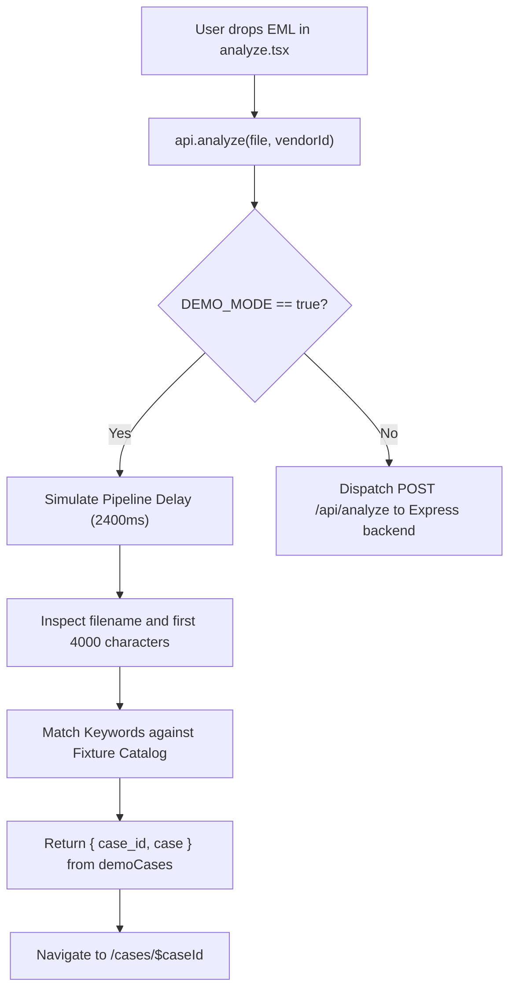

# SentinelMail End-to-End Data Flow

This document details the complete end-to-end data flow when an email payload is ingested for forensic analysis in SentinelMail, tracing message progression through the frontend, proxy layers, backend analysis pipeline, database storage, and alerting subsystems.

```mermaid
flowchart TD
    subgraph Client ["Frontend (React / TanStack Router)"]
        UI["analyze.tsx<br/>(Dropzone / Attack Scenario)"]
        API["src/lib/api.ts<br/>api.analyze()"]
        Demo["Demo Mode Check<br/>VITE_DEMO_MODE=true?"]
        Fixture["Match Mock Fixture<br/>(demoCases)"]
        CaseView["Navigate to<br/>/cases/$caseId"]
    end

    subgraph Proxy ["Proxy & Ingestion Layer"]
        ViteProxy["Vite Dev Server Proxy<br/>(port 3000 -> 3001)"]
        NitroProxy["Nitro SSR Server Proxy<br/>(src/server.ts -> 3001)"]
    end

    subgraph Backend ["Express API Server (port 3001)"]
        Route["server/routes/analyze.ts<br/>POST /api/analyze"]
        Multer["Multer Memory Storage<br/>(25 MB cap)"]
        DBVendors["Fetch Vendor Baseline<br/>& Case Sequence (SM-XXXX)"]

        subgraph Pipeline ["7-Step Forensic Analysis Engine"]
            S1["Step 1: EML Parsing & Rules<br/>(services/eml-parser.ts)"]
            S2["Step 2: AI Intent Classification<br/>(services/classifier.ts)<br/>Gemini 2.5 Flash / GPT-4o-mini"]
            S3["Step 3: Behavioral Analysis<br/>(services/behavioral.ts)"]
            S4["Step 4: Score Fusion<br/>(services/scoring.ts)"]
            S5["Step 5: Campaign Correlation<br/>(services/campaign.ts)"]
            S6["Step 6: Database Persistence<br/>(PostgreSQL / MongoDB / MemoryStore)"]
            S7["Step 7: Containment Alerts<br/>(services/containment.ts)"]
        end
    end

    subgraph Storage ["Persistence Layer"]
        PG[("PostgreSQL")]
        Mongo[("MongoDB")]
        Mem[("MemoryStore (Fallback)")]
    end

    subgraph External ["External Alert Channels"]
        Slack["Slack Webhook"]
        Teams["MS Teams Webhook"]
        Webhook["Custom Webhook"]
        Email["SMTP Email"]
    end

    UI -->|"File dropped / Scenario selected"| API
    API --> Demo
    Demo -- Yes -->|"Bypass Network"| Fixture --> CaseView
    Demo -- No -->|"POST /api/analyze (FormData)"| ViteProxy
    Demo -- No -->|"POST /api/analyze (FormData)"| NitroProxy
    ViteProxy --> Route
    NitroProxy --> Route

    Route --> Multer --> DBVendors --> S1
    S1 --> S2 --> S3 --> S4 --> S6 --> S5 --> S7
    S6 -.-> PG & Mongo & Mem
    S7 -.-> Slack & Teams & Webhook & Email

    Route -->|"HTTP 201 { case_id, case }"| API
    API --> CaseView
```

---

## Analysis Pipeline Walkthrough

### 1. User Drops `.eml` File in `analyze.tsx`

- **Source:** [`src/routes/analyze.tsx`](file:///c:/Users/dsaro/Downloads/Sentinel-Mail-updated/Sentinel-Mail-main/src/routes/analyze.tsx)
- **Actions:**
  - The user drags and drops a raw RFC822 `.eml` file into the dropper area, selects a file via file picker, or clicks **"1-Click Load & Test"** from the Attack Scenario Suite (e.g. Compromised Genuine Vendor, Invoice Fraud, CEO Impersonation, Credential Phishing, Malware Lure, or Clean Baseline).
  - Optionally, the user selects a specific **Supplier Baseline Alignment** profile from the dropdown, or leaves it on auto-detection.
  - Clicking **"Run Forensic Analysis"** initializes a 6-stage animated progress stepper displaying real-time inspection progress:
    1. Parsing RFC822 headers & MIME body
    2. Extracting IOCs (domains, URLs, IPs, hashes)
    3. Comparing vendor baseline & bank accounts
    4. Running multi-layer threat classifier
    5. Correlating cross-tenant campaign clusters
    6. Generating autonomous containment decision

---

### 2. Frontend Submits Payload via `api.analyze()`

- **Source:** [`src/lib/api.ts`](file:///c:/Users/dsaro/Downloads/Sentinel-Mail-updated/Sentinel-Mail-main/src/lib/api.ts#L105-L172)
- **Demo Mode Evaluation:**
  - If `VITE_DEMO_MODE=true`, the network call is completely bypassed (see [Demo Mode Path](#demo-mode-path-vitedemomodetrue) below).
- **Live Mode Evaluation:**
  - Wraps the raw file and optional `vendor_id` into a `FormData` object:
    ```typescript
    const form = new FormData();
    form.append("file", file);
    if (vendorId) form.append("vendor_id", vendorId);
    ```
  - Appends Firebase user authorization headers (`Bearer <token>`) if an active session is detected.
  - Dispatches an HTTP `POST` request to `/api/analyze` wrapped with a 30-second `AbortController` timeout.

---

### 3. Proxy Routing: Vite Dev Proxy or Nitro SSR Proxy

Browser requests targeting `/api/*` are reverse-proxied to the Express backend running on port `3001`:

1. **Vite Development Server Proxy:**
   - **Source:** [`vite.config.ts`](file:///c:/Users/dsaro/Downloads/Sentinel-Mail-updated/Sentinel-Mail-main/vite.config.ts#L23-L29)
   - In local development (`npm run dev`), Vite's dev server proxies `/api` calls directly to `http://localhost:3001` with `changeOrigin: true`.
2. **Nitro SSR Server Proxy:**
   - **Source:** [`src/server.ts`](file:///c:/Users/dsaro/Downloads/Sentinel-Mail-updated/Sentinel-Mail-main/src/server.ts#L50-L79)
   - In production SSR builds, Nitro intercepts requests where the path starts with `/api/` and proxies them using node `fetch` (`duplex: "half"`) to `http://localhost:3001`.
   - If the Express backend is not running, it catches connection errors and responds with `HTTP 502 Bad Gateway`.

---

### 4. Express Route Processing Pipeline

- **Source:** [`server/routes/analyze.ts`](file:///c:/Users/dsaro/Downloads/Sentinel-Mail-updated/Sentinel-Mail-main/server/routes/analyze.ts)

When `POST /api/analyze` reaches the Express application:

#### a. Rate Limiting & Multer Parsing

- An in-memory rate limiter verifies that the client IP has not exceeded 10 analysis requests per minute (`HTTP 429` if exceeded).
- Multer (`multer.memoryStorage()`) parses the incoming `multipart/form-data`.
- File validations enforce:
  - Presence of an uploaded file.
  - Extension check (`.eml` required).
  - Payload size under 25 MB (`HTTP 400` if validation fails).

#### b. Vendor Baseline Retrieval & Case Sequence

- Fetches existing vendor baselines from the active database (`SELECT * FROM vendors ORDER BY name`), mapping approved bank suffixes, trusted domains, known contacts, and historical anomaly records.
- Generates a sequential identifier using the sequence counter (`SELECT nextval('case_number_seq')`), yielding identifiers like `SM-1043`.

#### c. Step 1: EML Parsing & Rule-Based Analysis

- **Service:** [`server/services/eml-parser.ts`](file:///c:/Users/dsaro/Downloads/Sentinel-Mail-updated/Sentinel-Mail-main/server/services/eml-parser.ts)
- Decodes RFC822 headers and MIME boundaries (handling base64 and quoted-printable encodings).
- **Header & Identity Analysis:** Extracts `From`, `To`, `Reply-To`, `Return-Path`, `Subject`, `Date`, and evaluates SPF/DKIM/DMARC status from `Authentication-Results` and `Received-SPF`.
- **Technical Forensics & IOC Extraction:** Extracts all domains, hyperlinks, recipient mailboxes, and attachments. Computes attachment SHA-256 hashes and inspects for suspicious signatures (e.g. double extensions like `.pdf.exe` or executable filetypes).
- **Financial Forensics:** Scans email text for invoice numbers, billed currency, amounts at risk, and banking account numbers / routing numbers.
- **Routing Hops:** Parses `Received` headers to assemble the chronological relay path (IP address, reverse DNS, geolocation, and hop latency).
- **Vendor Matching:** Associates the message with a vendor profile by explicit ID, exact domain match, or fuzzy lookalike domain matching.
- Returns an initial `Case` model with baseline rule signals and an initial risk score.

#### d. Step 2: AI Classification Overlay (Gemini / OpenAI)

- **Service:** [`server/services/classifier.ts`](file:///c:/Users/dsaro/Downloads/Sentinel-Mail-updated/Sentinel-Mail-main/server/services/classifier.ts)
- Combines deterministic pattern matching with LLM natural language understanding:
  - **Layer 1 (Deterministic):** Heuristic keyword checks detect urgent wire lures, payment diversion phrases, credential harvesting links, and executive impersonation signatures.
  - **Layer 2 (Generative AI):**
    - If `GEMINI_API_KEY` is configured: sends subject and email body to **Google Gemini 2.5 Flash** (`@google/genai`).
    - If `OPENAI_API_KEY` is configured (and no Gemini key): falls back to **OpenAI GPT-4o-mini** (`openai`).
    - If no API keys are present: proceeds with rule-based fallback without failing.
- The AI engine classifies intent into one of five categories: `invoice_fraud`, `ceo_impersonation`, `credential_phishing`, `malware_delivery`, or `benign`.
- Extracts model confidence, identified coercive phrases, and justification reasoning.
- If AI classification differs with high confidence, it updates the threat category and injects an AI Intent Analysis signal into the forensic timeline and evidence collection.

#### e. Step 3: Behavioral Comparison against Vendor Baseline

- **Service:** [`server/services/behavioral.ts`](file:///c:/Users/dsaro/Downloads/Sentinel-Mail-updated/Sentinel-Mail-main/server/services/behavioral.ts)
- Evaluates anomalies between the current message and the matched vendor record:
  1. **Sender Domain Match:** Flags domain not present in `trusted_domains` (+22 risk delta).
  2. **Contact Match:** Flags unfamiliar sender not in `trusted_contacts` (+12 risk delta).
  3. **Reply-To Integrity:** Flags unseen or mismatched Reply-To address (+18 risk delta).
  4. **Bank Account Validation:** Audits remittance account suffix against `approved_bank_suffixes` (+28 risk delta).
  5. **Recipient Distribution:** Flags internal recipients outside `normal_recipients` (+8 risk delta).
  6. **Timing & Formality Drift:** Checks for off-hours dispatch (+6 risk delta) or language style variance (+8 risk delta).
- Normalizes cumulative `scoreDelta` (bounded between -15 and +40), creates anomaly items, and constructs the `vendor_relationship` evidence structure.

#### f. Step 4: Score Fusion

- **Service:** [`server/services/scoring.ts`](file:///c:/Users/dsaro/Downloads/Sentinel-Mail-updated/Sentinel-Mail-main/server/services/scoring.ts)
- `fuseScores()` calculates the composite risk index:
  $$\text{finalScore} = \text{clamp}_{0..99}(\text{ruleScore} + \text{behavioralDelta} + \text{campaignDelta} + \text{aiAgreementBonus})$$
  - `campaignDelta`: +12 if correlated with an active campaign cluster.
  - `aiAgreementBonus`: +5 if generative AI confirms rule-based classification.
- Computes final confidence score ($0.5 + \frac{\text{finalScore}}{200}$, bounded between 0.35 and 0.98).
- Classifies severity tier:
  - `critical`: score $\ge 80$
  - `high`: score $\ge 60$
  - `medium`: score $\ge 35$
  - `low`: score $> 0$
  - `safe`: score $= 0$
- Generates the executive decision banner:
  - If invoice fraud with remittance diversion: flags **"Hold payment recommended — payment-change evidence requires out-of-band verification"**.
  - If benign: flags **"No high-risk indicators found in the uploaded email"**.
  - Otherwise: flags **"Review required — investigate the evidence before acting"**.

#### g. Step 5: Database Persistence

- **Service:** [`server/db/connection.ts`](file:///c:/Users/dsaro/Downloads/Sentinel-Mail-updated/Sentinel-Mail-main/server/db/connection.ts) / [`server/db/mongo.ts`](file:///c:/Users/dsaro/Downloads/Sentinel-Mail-updated/Sentinel-Mail-main/server/db/mongo.ts)
- Calculates the SHA-256 hash of the raw EML bytes for deduplication.
- Persists case record through the database adapter hierarchy:
  1. **PostgreSQL** (when `DATABASE_URL` is set): executes parameterized `INSERT INTO cases` storing JSONB evidence blocks, timeline entries, relay hops, tenant ID, and raw payload.
  2. **MongoDB** (when `MONGODB_URI` is set): executes `cases.updateOne` with `$set` and `upsert: true`.
  3. **MemoryStore** (fallback): stores case object in in-memory `Map` structures.
- Updates the associated vendor profile: updates `last_interaction`, records rolling anomaly history (last 20 items), and updates `risk_state` (`trusted`, `watch`, or `at_risk`).

#### h. Step 6: Campaign Correlation & Graph Synthesis

- **Service:** [`server/services/campaign.ts`](file:///c:/Users/dsaro/Downloads/Sentinel-Mail-updated/Sentinel-Mail-main/server/services/campaign.ts)
- Extracts IOCs (domains, URLs, reply-to, bank suffixes, attachment hashes, relay IPs) and inserts them into the `indicators` table.
- Executes a cross-case join identifying existing cases that share $\ge 2$ distinct indicator types.
- If a correlation cluster exists:
  - Attaches the case to an existing campaign or instantiates a new campaign record.
  - Builds a D3 force-directed `campaign_graph` (nodes: cases, domains, IPs, bank accounts; links: indicator matches).
  - Re-fuses the risk score with `campaignMatchCount` and updates the case record in the database.

#### i. Step 7: Containment Alerts

- **Service:** [`server/services/containment.ts`](file:///c:/Users/dsaro/Downloads/Sentinel-Mail-updated/Sentinel-Mail-main/server/services/containment.ts)
- When critical risk thresholds are breached or automated containment is triggered (such as invoice fraud with unauthorized bank modifications or risk score $\ge 85$ during inline processing):
- Asynchronously dispatches non-blocking notifications across configured enterprise channels:
  1. **Generic Webhook:** `CONTAINMENT_WEBHOOK_URL` receives a JSON incident packet.
  2. **Slack:** `SLACK_WEBHOOK_URL` receives Slack Block Kit message with severity emojis, financial details, and decision guidance.
  3. **Microsoft Teams:** `TEAMS_WEBHOOK_URL` receives an Adaptive Card (v1.4) FactSet.
  4. **SMTP Email:** `SMTP_HOST`, `SMTP_FROM`, and `ALERT_EMAIL_TO` deliver high-priority alerts to the incident response team.

---

### 5. Backend Response

- The Express endpoint responds with `HTTP 201 Created`:
  ```json
  {
    "case_id": "SM-1043",
    "case": { ... }
  }
  ```
- If parsing or pipeline analysis fails, it responds with `HTTP 422 Unprocessable Entity`:
  ```json
  {
    "message": "Unable to analyze this email."
  }
  ```

---

### 6. Frontend Navigation & Case Inspection

- In [`src/routes/analyze.tsx`](file:///c:/Users/dsaro/Downloads/Sentinel-Mail-updated/Sentinel-Mail-main/src/routes/analyze.tsx), the promise resolves:
  1. Stepper marks all 6 stages as completed.
  2. Sonner toast displays: `"Analysis complete — Forensic incident record created."`
  3. TanStack Router navigates to `/cases/$caseId`.
- Route `/cases/$caseId` calls `api.getCase(caseId)`:
  - Renders interactive evidence cards (Sender Auth, Financial Audit, Routing Path, Intent Signals).
  - Renders chronological forensic timeline.
  - Renders cross-tenant campaign graph visualizer (if linked to a campaign).
  - Equips analysts with containment action buttons: **Hold Payment**, **Block Sender**, **Quarantine Domain**, or **Mark Safe**.

---

## Demo Mode Path (`VITE_DEMO_MODE=true`)

SentinelMail includes a fully functional offline demo mode designed for presentations, testing, and air-gapped environments without requiring an active backend or database connection.



### How Demo Mode Works

1. **Activation:** Activated by setting `VITE_DEMO_MODE=true` in `.env`.
2. **Zero Network Latency / Zero Failure:** `src/lib/api.ts` intercepts calls to `api.analyze()`, `api.listCases()`, `api.getCase()`, and `api.listVendors()`.
3. **Keyword Heuristic Matching:**
   - Reads file name and samples the first 4,000 characters of the payload.
   - Matches against attack scenario patterns:
     - `supply` / `88213` / `invoice-fraud` $\rightarrow$ Case `c-1042` (Supply Co Remittance Diversion)
     - `harborline` / `po-55129` / `compromised` $\rightarrow$ Case `c-1037` (Harborline Metals BEC)
     - `ceo` / `confidential` / `executive` $\rightarrow$ Case `c-1041` (Executive Impersonation / Whaling)
     - `m365` / `credential` / `session expire` $\rightarrow$ Case `c-1035` (M365 Credential Harvest)
     - `malware` / `.exe` / `overdue_statement` $\rightarrow$ Case `c-1031` (Freight Statement Malware Delivery)
     - `benign` / `clean` / `inv-2026-091` $\rightarrow$ Case `c-1028` (Aster Manufacturing Baseline Clean)
4. **Deterministic Return:** Returns a pre-built case object from `demoCases` with full forensic evidence cards, RFC822 relay hops, supplier baselines, and campaign graph structures.
