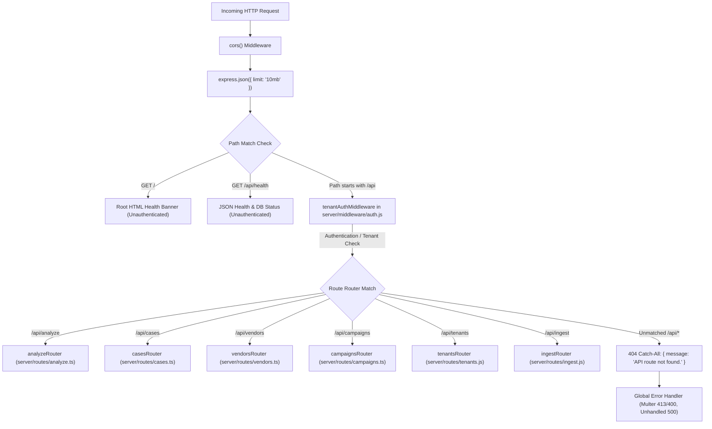

# SentinelMail Engineer Onboarding: API Layer, Routing, and Authentication/Tenancy

Welcome to the SentinelMail backend engineering team. This document provides a complete, code-verified technical onboarding guide for the **API Layer**, **Routing Pipeline**, **Authentication & Multi-Tenant Scoping**, and the **Complete .EML Forensic Lifecycle**.

This document is derived strictly from the active codebase (`server/index.ts`, `server/middleware/auth.js`, and `server/routes/*`). Business logic engines and database storage drivers are referenced by name without re-explaining their internals.

---

## Table of Contents
1. [The Big Picture: Request Lifecycle & Middleware Order](#1-the-big-picture-request-lifecycle--middleware-order)
2. [Authentication & Multi-Tenancy (`auth.js`)](#2-authentication--multi-tenancy-authjs)
3. [Complete API Route Inventory (Grouped by File)](#3-complete-api-route-inventory-grouped-by-file)
4. [The Complete .EML Lifecycle: Manual Upload vs. Automated Ingestion](#4-the-complete-eml-lifecycle-manual-upload-vs-automated-ingestion)
5. [Webhook Authentication Deep Dive (M365 & Google Workspace)](#5-webhook-authentication-deep-dive-m365--google-workspace)
6. [Known Gaps & Architectural Vulnerabilities](#6-known-gaps--architectural-vulnerabilities)

---

## 1. The Big Picture: Request Lifecycle & Middleware Order

All HTTP requests to the SentinelMail backend enter through the Express application initialized in [`server/index.ts`](file:///c:/Users/dsaro/Downloads/Sentinel-Mail-updated%20(2)/Sentinel-Mail-updated/Sentinel-Mail-main/server/index.ts).

### 1.1 Startup & Database Cascade
Before the HTTP listener opens on port `3001` (configured via `PORT` or `API_PORT`), the server attempts a **three-tier database cascade**:
1. **Tier 1 (PostgreSQL)**: If `DATABASE_URL` is set, attempts connection via `initDbPool()` in [`server/db/connection.ts`](file:///c:/Users/dsaro/Downloads/Sentinel-Mail-updated%20(2)/Sentinel-Mail-updated/Sentinel-Mail-main/server/db/connection.ts) and executes migrations via `runMigrations()` in [`server/db/migrate.ts`](file:///c:/Users/dsaro/Downloads/Sentinel-Mail-updated%20(2)/Sentinel-Mail-updated/Sentinel-Mail-main/server/db/migrate.ts).
2. **Tier 2 (MongoDB)**: If PostgreSQL fails or is unconfigured, attempts connection via `initMongoDb()` in [`server/db/mongo.ts`](file:///c:/Users/dsaro/Downloads/Sentinel-Mail-updated%20(2)/Sentinel-Mail-updated/Sentinel-Mail-main/server/db/mongo.ts).
3. **Tier 3 (MemoryStore)**: Ephemeral, zero-config in-memory fallback. Prominently warns on startup that case and API key data will not survive restarts. In production mode (`NODE_ENV=production`), fallback to `MemoryStore` is explicitly blocked and triggers `process.exit(1)`.

### 1.2 Global Middleware Pipeline (Execution Order)

When an incoming HTTP request hits Express, it flows through the following middleware stack in exact sequential order:



1. **CORS (`cors`)**:
   - Compares the request `Origin` against `process.env.CORS_ORIGIN` (default: `http://localhost:3000,http://localhost:3001,http://127.0.0.1:3000`).
   - If origin is allowed (or if no origin header is present, e.g. curl/server-to-server), sets CORS headers and enables `credentials: true`. Otherwise returns `Error("Not allowed by CORS")`.
2. **JSON Body Parser (`express.json({ limit: "10mb" })`)**:
   - Parses incoming JSON bodies up to 10 MB. Note: multipart payloads (like manual `.eml` uploads) bypass this parser and are handled downstream by `multer`.
3. **Unauthenticated Health Endpoints**:
   - `GET /`: Returns human-readable HTML confirming the backend is running.
   - `GET /api/health`: Returns `{ status: "ok", database: "postgresql" | "mongodb" | "memory", timestamp: "..." }`. **Crucial Detail:** This endpoint is registered *before* the authentication layer, making it accessible to Kubernetes liveness probes and uptime monitors without credentials.
4. **Tenant Authentication Layer (`app.use("/api", tenantAuthMiddleware)`)**:
   - Applied to **all** routes mounted under `/api` (with an internal bypass for webhook notifications, detailed in Section 2).
5. **Mounted Routers**:
   - Dispatches matching requests to their designated router.
6. **Catch-All 404 Handler (`app.use("/api", ...)`)**:
   - Any request matching `/api/*` that did not match an active route handler returns HTTP 404:
     ```json
     { "message": "API route not found." }
     ```
7. **Global Error Handler (`app.use((err, req, res, next) => ...)`)**:
   - Captures exceptions thrown synchronously or forwarded via `next(err)`.
   - Maps `MulterError` with `code === "LIMIT_FILE_SIZE"` to **HTTP 413**: `{ "message": "File exceeds 25 MB size limit." }`.
   - Maps generic Multer upload errors to **HTTP 400**.
   - Logs unhandled exceptions to `console.error` and returns **HTTP 500**: `{ "message": "Internal Server Error" }`.

---

## 2. Authentication & Multi-Tenancy (`auth.js`)

SentinelMail implements enterprise multi-tenancy and RBAC via [`server/middleware/auth.js`](file:///c:/Users/dsaro/Downloads/Sentinel-Mail-updated%20(2)/Sentinel-Mail-updated/Sentinel-Mail-main/server/middleware/auth.js).

### 2.1 Credential Extraction Priority
The middleware inspects three locations for caller credentials:
1. `req.headers["authorization"]` with prefix `Bearer <token>`
2. `req.headers["x-api-key"]`
3. `req.query.apiKey`

### 2.2 The Webhook Exemption
At the very top of `tenantAuthMiddleware`:
```javascript
if (req.path === "/ingest/m365/webhook" || req.path === "/ingest/google/webhook") {
  return next();
}
```
Incoming push notifications from Microsoft Graph and Google Cloud Pub/Sub do not follow standard user/API-key formats and are allowed to bypass this gateway. They perform their own provider-specific cryptographic/secret validation inside [`server/routes/ingest.js`](file:///c:/Users/dsaro/Downloads/Sentinel-Mail-updated%20(2)/Sentinel-Mail-updated/Sentinel-Mail-main/server/routes/ingest.js).

### 2.3 Authentication Branches & What Happens Under Each Condition

#### Case A: Missing Credentials (`!rawToken`)
- **In Development (`NODE_ENV !== "production"`)**:
  The request is **not** rejected. Instead, SentinelMail assigns a default local developer session:
  ```javascript
  req.user = {
    id: "00000000-0000-0000-0000-000000000002",
    role: "admin",
    name: "Security Admin",
    email: "security-admin@sentinelmail.io"
  };
  ```
  The tenant defaults to `DEFAULT_ORG_ID` (`00000000-0000-0000-0000-000000000001`, "Sentinel Corporation", slug `sentinel-corp`).
  The middleware then executes `resolveTenantContext()` to allow header-based tenant switching.
- **In Production (`NODE_ENV === "production"`)**:
  The request is immediately terminated with **HTTP 401 Unauthorized**:
  ```json
  { "message": "Authentication required. Provide a valid Firebase ID token or API key." }
  ```

#### Case B: SentinelMail API Key (`sm_live_...`)
- Validated via `validateApiKey(rawToken)` in [`server/services/tenant.js`](file:///c:/Users/dsaro/Downloads/Sentinel-Mail-updated%20(2)/Sentinel-Mail-updated/Sentinel-Mail-main/server/services/tenant.js).
- Hashes the plaintext token using SHA-256 and queries the `api_keys` table for a non-revoked record matching `key_hash`.
- **Invalid / Revoked Key**: Returns **HTTP 401 Unauthorized**:
  ```json
  { "message": "Invalid or revoked API key." }
  ```
- **Valid Key**:
  - Populates `req.user = { id: "apikey-<keyId>", role: keyContext.role, name: "API Key (<role>)" }`.
  - Sets default tenant to the organization permanently bound to that key: `{ id: keyContext.orgId, name: keyContext.orgName, slug: keyContext.orgSlug, plan: "enterprise" }`.
  - Runs `resolveTenantContext()`.

#### Case C: Firebase ID Token / JWT
- Passed to `firebaseAuth.verifyIdToken(rawToken)` via [`server/services/firebase-admin.js`](file:///c:/Users/dsaro/Downloads/Sentinel-Mail-updated%20(2)/Sentinel-Mail-updated/Sentinel-Mail-main/server/services/firebase-admin.js).
- *Development fallback*: If Firebase Admin SDK credentials are not configured locally, it extracts the JSON payload from the base64-encoded JWT claims without signature validation.
- **Verification Failure**: Returns **HTTP 401 Unauthorized**:
  ```json
  { "message": "Invalid or expired Firebase authentication token." }
  ```
- **User Resolution (`resolveUserByEmail`)**:
  Matches the token's email address in the database:
  - If user **does not exist** in SentinelMail's user table:
    - *In Development*: Automatically provisioned as a temporary local admin under Sentinel Corporation.
    - *In Production*: Returns **HTTP 403 Forbidden**:
      ```json
      { "message": "Firebase account is authenticated but is not provisioned in SentinelMail." }
      ```
  - If user **exists**: Binds `req.user` (`id`, `firebaseUid`, `email`, `name`, `role`) and assigns the user's registered organization as `defaultTenant`. Runs `resolveTenantContext()`.

### 2.4 Tenant Context Resolution (`resolveTenantContext`)
Clients can request a specific tenant scope using the `X-Tenant-ID` header or `?tenant=` query parameter.

```javascript
async function resolveTenantContext(req, userRole, defaultTenant) {
  const requestedTenant = req.headers["x-tenant-id"] || req.query.tenant;
  if (!requestedTenant) {
    return { ok: true, tenant: defaultTenant };
  }

  if (userRole !== "admin") {
    if (requestedTenant !== defaultTenant.id && requestedTenant !== defaultTenant.slug) {
      return {
        ok: false,
        status: 403,
        message: "Forbidden: Non-admin users cannot switch tenant context.",
      };
    }
    return { ok: true, tenant: defaultTenant };
  }

  const org = await getOrganization(requestedTenant);
  if (!org) {
    return {
      ok: false,
      status: 404,
      message: `Tenant '${requestedTenant}' not found.`,
    };
  }

  return { ok: true, tenant: { id: org.id, name: org.name, slug: org.slug, plan: org.plan || "enterprise" } };
}
```

- **Non-Admin Users (`userRole !== "admin"`)**: If they specify an `X-Tenant-ID` or `?tenant=` that differs from their assigned organization's UUID or slug, the request is blocked with **HTTP 403 Forbidden**.
- **Admin Users (`userRole === "admin"`)**: Permitted to switch tenant context to any valid organization. If the specified UUID or slug does not exist, returns **HTTP 404 Not Found**.
- On success, `req.tenant` is attached: `{ id, name, slug, plan }`.

### 2.5 Role-Based Access Control (`requireRole(allowedRoles)`)
Applied to sensitive mutation endpoints (e.g. creating vendors, deleting vendors, issuing API keys):
- Checks `req.user?.role`.
- If missing: returns **HTTP 401 Unauthorized** (`{ message: "Unauthenticated." }`).
- If `req.user.role === "admin"`: **Always succeeds** (Admin is a superuser across all endpoints).
- If role is not in `allowedRoles`: returns **HTTP 403 Forbidden**:
  ```json
  { "message": "Forbidden: Action requires one of [<roles>], current role is '<role>'." }
  ```

---

## 3. Complete API Route Inventory (Grouped by File)

Every route in the system is mounted under `/api` in [`server/index.ts`](file:///c:/Users/dsaro/Downloads/Sentinel-Mail-updated%20(2)/Sentinel-Mail-updated/Sentinel-Mail-main/server/index.ts).

### 3.1 `server/routes/analyze.ts` (Manual Forensic Upload)
- **Base Mount**: `/api/analyze`

| Method | Sub-path | Input / Headers | Auth & Tenancy Checks | Success Response | Error Responses |
| :--- | :--- | :--- | :--- | :--- | :--- |
| `POST` | `/` | **Multipart Form-Data**:<br>• `file` (binary `.eml`, max 25MB)<br>• `vendor_id` (optional string UUID) | • `tenantAuthMiddleware`<br>• Local IP rate limiter (10 req/min/IP)<br>• Vendors queried strictly for `req.tenant.id` | `201 Created`<br>`{ case_id: string, case: Case }` | • `400`: Missing file or not ending in `.eml`<br>• `413`: File exceeds 25 MB<br>• `429`: Rate limit exceeded<br>• `422`: Parsing failure |

---

### 3.2 `server/routes/cases.ts` (Case Management & Actions)
- **Base Mount**: `/api/cases`

| Method | Sub-path | Input / Headers | Auth & Tenancy Checks | Success Response | Error Responses |
| :--- | :--- | :--- | :--- | :--- | :--- |
| `GET` | `/` | None | • `tenantAuthMiddleware`<br>• Query: `WHERE org_id = $1` (strictly isolates summaries) | `200 OK`<br>Array of `CaseSummary` objects | • `500`: Database error |
| `GET` | `/:caseId` | Path: `caseId` (UUID or `SM-XXXX`) | • `tenantAuthMiddleware`<br>• Query: `WHERE (id = $1 OR case_number = $1) AND org_id = $2` | `200 OK`<br>Full `Case` entity with actions | • `404`: Case not found or belongs to another tenant |
| `GET` | `/:caseId/raw` | Path: `caseId` | • `tenantAuthMiddleware`<br>• Query: `WHERE org_id = $2` | `200 OK`<br>`Content-Type: message/rfc822`<br>Binary `.eml` attachment | • `404`: Case not found or `raw_eml` empty |
| `POST` | `/:caseId/action` | JSON body:<br>`{ type: string, note?: string, analyst?: string }`<br>Types: `hold_payment`, `mark_safe`, `escalate`, `confirm_threat` | • `tenantAuthMiddleware`<br>• Verifies case belongs to `req.tenant.id` before mutation<br>• Updates `decision` and `triage_minutes` scoped by `org_id` | `200 OK`<br>`{ ok: true }` | • `400`: Invalid action type<br>• `404`: Case not found or wrong tenant |
| `GET` | `/:caseId/report` | Header: `Accept: application/pdf` (optional) | • `tenantAuthMiddleware`<br>• Query scoped to `req.tenant.id` | `200 OK`<br>Binary PDF or plain-text report | • `404`: Case not found or wrong tenant |

---

### 3.3 `server/routes/vendors.ts` (Vendor Baseline Registry)
- **Base Mount**: `/api/vendors`

| Method | Sub-path | Input / Headers | Auth & Tenancy Checks | Success Response | Error Responses |
| :--- | :--- | :--- | :--- | :--- | :--- |
| `GET` | `/` | None | • `tenantAuthMiddleware`<br>• Query: `WHERE org_id = $1` | `200 OK`<br>Array of `VendorProfile` | • `500`: Query error |
| `GET` | `/:vendorId` | Path: `vendorId` (UUID) | • `tenantAuthMiddleware`<br>• Query: `WHERE id = $1 AND org_id = $2` | `200 OK`<br>`VendorProfile` with `related_case_ids` | • `404`: Vendor not found or wrong tenant |
| `POST` | `/` | JSON body:<br>`{ name, trusted_domains, trusted_contacts, approved_bank_suffixes, normal_recipients }` | • `tenantAuthMiddleware`<br>• `requireRole(["analyst"])` (analyst or admin)<br>• Persists with `org_id = req.tenant.id` | `201 Created`<br>Created `VendorProfile` | • `400`: Name missing<br>• `403`: Role insufficient |
| `PUT` | `/:vendorId` | JSON body: partial `VendorProfile` | • `tenantAuthMiddleware`<br>• `requireRole(["analyst"])`<br>• `WHERE id = $6 AND org_id = $7` | `200 OK`<br>Updated `VendorProfile` | • `404`: Vendor not found or wrong tenant |
| `DELETE`| `/:vendorId`| Path: `vendorId` | • `tenantAuthMiddleware`<br>• `requireRole(["admin"])` (Admin only!)<br>• `WHERE id = $1 AND org_id = $2` | `200 OK`<br>`{ ok: true, deleted: id }` | • `403`: Non-admin<br>• `404`: Vendor not found |

---

### 3.4 `server/routes/campaigns.ts` (Attack Campaign Clusters)
- **Base Mount**: `/api/campaigns`

| Method | Sub-path | Input / Headers | Auth & Tenancy Checks | Success Response | Error Responses |
| :--- | :--- | :--- | :--- | :--- | :--- |
| `GET` | `/` | None | • `tenantAuthMiddleware`<br>• Query: `WHERE org_id = $1`<br>• Sanitizes `case_ids` and `victim_teams` | `200 OK`<br>Array of `Campaign` objects | • `500`: Query error |
| `GET` | `/:campaignId` | Path: `campaignId` | • `tenantAuthMiddleware`<br>• Query: `WHERE id = $1 AND org_id = $2`<br>• Resolves linked cases scoped to `org_id` | `200 OK`<br>`Campaign` with embedded case summaries | • `404`: Campaign not found or wrong tenant |

---

### 3.5 `server/routes/tenants.js` (Tenant Administration & API Keys)
- **Base Mount**: `/api/tenants`

| Method | Sub-path | Input / Headers | Auth & Tenancy Checks | Success Response | Error Responses |
| :--- | :--- | :--- | :--- | :--- | :--- |
| `GET` | `/current` | None | • `tenantAuthMiddleware` | `200 OK`<br>`{ tenant: req.tenant, user: req.user }` | • `401`: Unauthenticated |
| `POST` | `/organizations` | JSON: `{ name, slug, plan }` | • `tenantAuthMiddleware`<br>• `requireRole(["admin"])` | `201 Created`<br>Created Organization | • `400`: Name or slug missing<br>• `403`: Non-admin |
| `GET` | `/api-keys` | None | • `tenantAuthMiddleware`<br>• `requireRole(["admin"])`<br>• Scoped to `req.tenant.id` | `200 OK`<br>List of API keys (hashes omitted) | • `403`: Non-admin |
| `POST` | `/api-keys` | JSON: `{ name, role }`<br>Role: `admin`, `analyst`, `auditor` | • `tenantAuthMiddleware`<br>• `requireRole(["admin"])`<br>• Key bound to `req.tenant.id` | `201 Created`<br>`{ apiKey: "sm_live_...", ... }` | • `400`: Name missing or invalid role |
| `GET` | `/users` | None | • `tenantAuthMiddleware`<br>• `requireRole(["admin", "auditor"])` | `200 OK`<br>Array of tenant members | • `403`: Analyst or unauthenticated |
| `POST` | `/users` | JSON: `{ email, name, role }` | • `tenantAuthMiddleware`<br>• `requireRole(["admin"])`<br>• User bound to `req.tenant.id` | `201 Created`<br>Created User record | • `400`: Missing fields or invalid role |

---

### 3.6 `server/routes/ingest.js` (Mailbox Connectors & Webhooks)
- **Base Mount**: `/api/ingest`

| Method | Sub-path | Input / Headers | Auth & Tenancy Checks | Success Response | Error Responses |
| :--- | :--- | :--- | :--- | :--- | :--- |
| `GET` | `/connectors` | None | • `tenantAuthMiddleware`<br>• Filtered strictly by `req.tenant.id` | `200 OK`<br>Array of active connectors | • `500`: Query error |
| `POST` | `/connectors` | JSON: `{ provider, name, mailbox, config }` | • `tenantAuthMiddleware`<br>• `requireRole(["admin"])`<br>• Bound to `req.tenant.id` | `201 Created`<br>Created Connector record | • `400`: Missing provider/mailbox |
| `POST` | `/m365/webhook` | Query: `?validationToken=...`<br>**OR** Body: `{ raw_eml, filename }`<br>**OR** Body: `{ value: [...] }` | • **Bypasses** `tenantAuthMiddleware`<br>• Rate limiter (30 req/min/IP)<br>• Handshake: returns validationToken<br>• Direct EML: `authenticateIngestRequest`<br>• Graph push: `clientState` validation | • Handshake: `200 text/plain`<br>• Direct EML: `201 Created`<br>• Push: `202 Accepted` | • `400`: Invalid payload<br>• `401`: Bad API key or invalid `clientState` |
| `POST` | `/google/webhook` | Body: `{ raw_eml, filename }`<br>**OR** Body: `{ message: { data: "..." } }` | • **Bypasses** `tenantAuthMiddleware`<br>• Rate limiter (30 req/min/IP)<br>• Direct EML: `authenticateIngestRequest`<br>• Pub/Sub: `PUBSUB_VERIFICATION_TOKEN` | • Direct EML: `201 Created`<br>• PubSub: `200 OK` | • `400`: Invalid payload<br>• `401`: Bad API key or token mismatch |

---

## 4. The Complete .EML Lifecycle: Manual Upload vs. Automated Ingestion

Understanding how an `.eml` message traverses SentinelMail is critical for every backend engineer. The codebase contains two distinct ingestion paths:

```
(a) MANUAL UPLOAD:        Browser -> POST /api/analyze -> analyze.ts
(b) AUTOMATED INGESTION:  Mailbox / Webhook -> POST /api/ingest/{m365,google}/webhook -> ingestion-processor.js
```

### 4.1 Path A: Manual Upload (`analyze.ts`)

1. **Request Ingress**: Client submits a `multipart/form-data` POST request to `/api/analyze` containing a file field named `file` and an optional string `vendor_id`.
2. **Middleware Execution**:
   - `cors`: Validates client origin.
   - `tenantAuthMiddleware`: Verifies token/key; establishes `req.user` and `req.tenant`.
   - `rateLimiter`: Enforces max 10 requests per minute per IP.
   - `multer({ storage: memoryStorage(), limits: { fileSize: 25MB } })`: Buffers file bytes into `req.file.buffer`.
3. **Pre-flight Validation**:
   - Rejects if `!req.file` (HTTP 400).
   - Rejects if filename does not end in `.eml` (HTTP 400).
4. **Vendor Baseline Retrieval**:
   - Executes `SELECT * FROM vendors WHERE org_id = $1` using `req.tenant.id`.
5. **Sequential ID Generation**:
   - Executes `SELECT nextval('case_number_seq')` to generate `SM-<seq>`.
6. **MIME Parsing & Heuristic Rules**:
   - Calls `analyzeEml({ bytes, filename, vendors, vendorId, caseNumber })` in [`server/services/eml-parser.ts`](file:///c:/Users/dsaro/Downloads/Sentinel-Mail-updated%20(2)/Sentinel-Mail-updated/Sentinel-Mail-main/server/services/eml-parser.ts).
   - Decompiles RFC822 headers, text body, HTML body, attachments.
   - Parses `Received:` headers chronologically into `relay_path` and calls `enrichIp()` via IPinfo to resolve country, ASN, and organization.
   - Runs deterministic threat classification (`classifyRules`), regex financial extraction (`financial`), and infrastructure origin evaluation (`assessOrigin`).
   - Computes initial `ruleThreatClass` and `ruleRiskScore`.
7. **Vendor Domain Matching**:
   - Matches `senderDomain` against `vendor.trusted_domains`. If client passed an explicit `vendor_id`, uses that profile.
8. **AI-Assisted Classification**:
   - Calls `classifyEmail()` in [`server/services/classifier.ts`](file:///c:/Users/dsaro/Downloads/Sentinel-Mail-updated%20(2)/Sentinel-Mail-updated/Sentinel-Mail-main/server/services/classifier.ts).
   - Delimiters (`<email_content>`, `<instruction>`) are stripped via `sanitizeDelimiterTags`.
   - Dispatches prompt to Gemini (with OpenAI fallback and 10s `AbortSignal.timeout`).
   - **Anti-Downgrade Guard**: If deterministic rules flagged `invoice_fraud` or detected payment changes, AI downgrade to `benign` is blocked.
9. **Vendor Behavioral Comparison**:
   - Calls `compareBehavior()` in [`server/services/behavioral.ts`](file:///c:/Users/dsaro/Downloads/Sentinel-Mail-updated%20(2)/Sentinel-Mail-updated/Sentinel-Mail-main/server/services/behavioral.ts).
   - Evaluates send-time anomalies, recipient anomalies, bank suffix mismatches, and stylometry.
10. **Score Fusion**:
    - Calls `fuseScores()` in [`server/services/scoring.ts`](file:///c:/Users/dsaro/Downloads/Sentinel-Mail-updated%20(2)/Sentinel-Mail-updated/Sentinel-Mail-main/server/services/scoring.ts).
    - Re-evaluates `calculateShouldHold()`.
    - **Crucial Hold Decision State**: Sets `kase.assigned_action = "Hold payment"` if hold conditions are met, but **`kase.decision` remains `"pending"`**. No automated containment alert is sent; the system awaits human analyst intervention.
11. **Database Insertion**:
    - Executes `INSERT INTO cases (id, case_number, subject, sender, ..., origin_assessment, domain_intelligence, raw_eml, eml_sha256, org_id) VALUES ($1..$25)`.
12. **Campaign Correlation**:
    - Calls `extractAndCorrelate()` in [`server/services/campaign.ts`](file:///c:/Users/dsaro/Downloads/Sentinel-Mail-updated%20(2)/Sentinel-Mail-updated/Sentinel-Mail-main/server/services/campaign.ts).
    - If `campaignResult.campaignId` is returned, re-fuses score with `campaignMatchCount`, recalculates severity and assigned action, and executes:
      `UPDATE cases SET campaign_id = $1, campaign_graph = $2, risk_score = $3, confidence = $4, severity = $5, assigned_action = $6, decision_banner = $7, updated_at = now() WHERE id = $8`.
13. **Vendor Telemetry Update**:
    - Executes `UPDATE vendors SET last_interaction = now() WHERE id = $1`.
    - Appends behavioral anomalies to `vendors.anomalies` and updates `risk_state`.
14. **HTTP Response**:
    - Returns **HTTP 201 Created** with JSON:
      ```json
      {
        "case_id": "9b1deb4d-3b7d-4bad-9bdd-2b0d7b3dcb6d",
        "case": { ... }
      }
      ```
    - The analyst's browser receives the full case and renders the Case Detail Dossier.

---

### 4.2 Path B: Automated Ingestion (`ingestion-processor.js`)

1. **Request Ingress**:
   - Webhook push or poller sends JSON to `/api/ingest/m365/webhook` or `/api/ingest/google/webhook` with `{ raw_eml: string, filename?: string }`.
2. **Middleware & Authentication**:
   - Bypasses global `tenantAuthMiddleware`.
   - Passes through `webhookRateLimiter` (30 req/min/IP).
   - Executes route-level `authenticateIngestRequest(req)`:
     - Checks `INGESTION_API_KEY` or validates token against `api_keys` table.
     - Resolves `tenantId` from key, `X-Tenant-ID` header, or `?tenant=` query param.
3. **Ingestion Processor Invocation**:
   - Calls `processIngestedMessage({ rawBytes, filename, tenantId, provider })` in [`server/services/ingestion-processor.js`](file:///c:/Users/dsaro/Downloads/Sentinel-Mail-updated%20(2)/Sentinel-Mail-updated/Sentinel-Mail-main/server/services/ingestion-processor.js).
4. **Execution Steps (Parallels & Divergences)**:
   - *Steps 1–3*: Fetches vendors for `tenantId`, generates case sequence, and calls `analyzeEml()`.
   - *Step 4 (Vendor Matching)*: Matches vendor **strictly by domain pattern**. Automated ingestion has no mechanism for the caller to provide an explicit `vendor_id`.
   - *Steps 5–7*: Runs AI classification (with anti-downgrade guard), vendor behavioral comparison, and initial score fusion.
   - *Step 8 (Autonomous Policy Containment — MAJOR DIVERGENCE)*:
     - Evaluates `calculateShouldHold()`.
     - **If hold is triggered**:
       - Immediately sets **`kase.decision = "payment_held"`** (NOT `"pending"`).
       - Sets `kase.assigned_action = "Hold payment"`.
       - Sets `kase.decision_banner = "AUTOMATED CONTAINMENT: Payment hold initiated upon mailbox delivery"`.
       - **Dispatches real-time containment alert**: Asynchronously fires `sendContainmentAlert()` to configured enterprise webhooks, Slack, Teams, or SMTP.
   - *Step 9*: Executes `INSERT INTO cases` with all 25 parameters (including `origin_assessment`, `domain_intelligence`, `org_id`).
   - *Step 10 (Campaign Correlation & Re-fusion)*:
     - Calls `extractAndCorrelate()`.
     - On campaign match: re-fuses score with `campaignMatchCount`, recalculates severity, and re-evaluates `calculateShouldHold()`.
     - If campaign correlation elevates the case to payment hold and an alert was not sent in Step 8, fires `sendContainmentAlert()`.
     - Persists update via:
       `UPDATE cases SET campaign_id = $1, campaign_graph = $2, risk_score = $3, confidence = $4, severity = $5, assigned_action = $6, decision_banner = $7, decision = $8, updated_at = now() WHERE id = $9`.
   - *Vendor Telemetry*: **Not executed.** (Automated ingestion does *not* mutate `vendors.last_interaction` or `vendors.anomalies`).
5. **HTTP Response**:
   - Webhook route returns **HTTP 201 Created**:
     ```json
     {
       "status": "ingested",
       "case_id": "...",
       "case": { ... },
       "auto_action_taken": true
     }
     ```

---

### 4.3 Key Divergences Table (Manual vs. Automated)

| Dimension | Manual Upload (`analyze.ts`) | Automated Ingestion (`ingestion-processor.js`) | Architectural Rationale / Impact |
| :--- | :--- | :--- | :--- |
| **Transport Format** | `multipart/form-data` (Multer memory file) | JSON body with UTF-8 / Base64 `raw_eml` | Mailbox webhooks transmit JSON payloads; browsers upload files. |
| **Authentication** | Global `tenantAuthMiddleware` (Bearer/Firebase) | Internal `authenticateIngestRequest` | Webhook endpoints must bypass browser Firebase session checks. |
| **Rate Limit** | 10 requests / min / IP (`analyzeRateLimits`) | 30 requests / min / IP (`webhookRateLimiter`) | Webhooks burst during high-volume mail deliveries. |
| **File Validation** | Enforces `.eml` filename suffix (HTTP 400) | Accepts any filename (defaults to synthetic timestamp) | Webhooks may deliver raw byte streams without filenames. |
| **Explicit Vendor ID**| Supported via `req.body.vendor_id` | Unsupported (Strict domain heuristic match) | Automated ingestion has no human in the loop to pick a vendor. |
| **Hold Decision** | `assigned_action = "Hold payment"`<br>**`decision = "pending"`** | `assigned_action = "Hold payment"`<br>**`decision = "payment_held"`** | **Core claim**: Ingestion autonomously contains threat before user reads mail; manual upload waits for analyst. |
| **Alert Dispatch** | No alert sent on upload (sent later on analyst action) | **`sendContainmentAlert()` dispatched immediately** | Automated containment must alert SOC/Treasury in real time. |
| **Vendor Mutations** | Updates `last_interaction` & `anomalies` | **No vendor table updates** | Avoids concurrent lock contention on vendor table during mail storms. |
| **Response Body** | `{ case_id, case }` | `{ status: "ingested", case_id, case, auto_action_taken }` | Ingest clients need `auto_action_taken` flag for orchestration. |

---

## 5. Webhook Authentication Deep Dive (M365 & Google Workspace)

How do the webhook endpoints confirm that a request genuinely originates from Microsoft or Google rather than an attacker spoofing webhook deliveries?

Here is what the code in [`server/routes/ingest.js`](file:///c:/Users/dsaro/Downloads/Sentinel-Mail-updated%20(2)/Sentinel-Mail-updated/Sentinel-Mail-main/server/routes/ingest.js) actually does:

### 5.1 Microsoft Graph Change Notifications (`POST /api/ingest/m365/webhook`)

1. **Validation Challenge Handshake**:
   - When registering a webhook subscription with Microsoft Graph, Microsoft issues a `POST` with a query parameter named `validationToken`.
   - **Code Behavior**:
     ```javascript
     const validationToken = req.query.validationToken;
     if (validationToken) {
       res.setHeader("Content-Type", "text/plain");
       return res.status(200).send(String(validationToken));
     }
     ```
   - Returns the token verbatim as plain text with HTTP 200 within 10 seconds, completing Graph subscription validation.
2. **Notification Signature / `clientState` Validation**:
   - Microsoft Graph does not use HMAC-SHA256 headers by default; instead, it includes an opaque `clientState` secret string in the JSON payload (`value[i].clientState`) that was supplied when the subscription was created.
   - **Code Behavior**:
     ```javascript
     const expectedClientState = process.env.M365_CLIENT_STATE;
     if (expectedClientState) {
       const allValid = value.every((event) => event.clientState === expectedClientState);
       if (!allValid) {
         return res.status(401).json({ message: "Invalid or missing clientState." });
       }
     } else if (process.env.NODE_ENV === "production") {
       const hasClientState = value.every((event) => Boolean(event.clientState));
       if (!hasClientState) {
         return res.status(401).json({ message: "M365 notifications require clientState in production." });
       }
     }
     ```
   - If `M365_CLIENT_STATE` is configured in `.env`, every event in the array must match it, or returns **HTTP 401**.
   - In production, if `M365_CLIENT_STATE` is unconfigured, it at least enforces that some non-empty `clientState` is present.
3. **Direct EML Webhook Ingestion**:
   - If `req.body.raw_eml` is provided, authentication is required via `authenticateIngestRequest(req)`:
     - Checks `INGESTION_API_KEY` or an active API key from the `api_keys` table.
     - Unauthenticated requests return **HTTP 401 Unauthorized**.

### 5.2 Google Workspace / Gmail Cloud Pub/Sub (`POST /api/ingest/google/webhook`)

1. **Pub/Sub Push Verification**:
   - Google Cloud Pub/Sub delivers push subscription messages formatted as:
     ```json
     {
       "message": {
         "data": "<base64-encoded-json>",
         "messageId": "..."
       }
     }
     ```
   - **Code Behavior**:
     ```javascript
     const pubsubSecret = process.env.PUBSUB_VERIFICATION_TOKEN;
     if (pubsubSecret) {
       const token = req.query.token || req.headers["x-goog-pubsub-token"];
       if (token !== pubsubSecret) {
         return res.status(401).json({ message: "Invalid Pub/Sub verification token." });
       }
     }
     ```
   - Validates that `?token=...` or header `X-Goog-Pubsub-Token` matches `PUBSUB_VERIFICATION_TOKEN`.
   - Decodes `message.data` from base64 to extract `emailAddress` and `historyId`. Returns **HTTP 200 OK** (`{ status: "accepted" }`).
2. **Direct EML Webhook Ingestion**:
   - When `req.body.raw_eml` is supplied, calls `authenticateIngestRequest(req)`, rejecting unauthenticated requests with **HTTP 401**.

---

## 6. Known Gaps & Architectural Vulnerabilities

The following architectural and routing gaps were directly observed in the live code:

### 6.1 Unverified Webhook Payloads When Secrets Are Omitted
- In [`server/routes/ingest.js`](file:///c:/Users/dsaro/Downloads/Sentinel-Mail-updated%20(2)/Sentinel-Mail-updated/Sentinel-Mail-main/server/routes/ingest.js#L272-L285): If `M365_CLIENT_STATE` is omitted from `.env` in non-production environments, Microsoft Graph webhook pushes are accepted without verifying caller identity.
- In [`server/routes/ingest.js`](file:///c:/Users/dsaro/Downloads/Sentinel-Mail-updated%20(2)/Sentinel-Mail-updated/Sentinel-Mail-main/server/routes/ingest.js#L344-L350): If `PUBSUB_VERIFICATION_TOKEN` is not set in `.env`, Google Pub/Sub push requests are accepted with **zero token or signature validation** across all environments.
- **Production Standard**: Standard Google Pub/Sub push notifications include an `Authorization: Bearer <JWT>` signed by Google's Service Account. The endpoint does not currently verify Google OIDC JWT signatures against Google's public JWKS endpoints (`https://www.googleapis.com/oauth2/v3/certs`).

### 6.2 Arbitrary Tenant Scoping via `INGESTION_API_KEY`
In [`server/routes/ingest.js:70-82`](file:///c:/Users/dsaro/Downloads/Sentinel-Mail-updated%20(2)/Sentinel-Mail-updated/Sentinel-Mail-main/server/routes/ingest.js#L70-L82):
```javascript
if (process.env.INGESTION_API_KEY && token === process.env.INGESTION_API_KEY) {
  const requestedTenant = req.headers["x-tenant-id"] || req.query.tenant;
  if (requestedTenant) {
    const org = await getOrganization(requestedTenant);
    if (org) return { orgId: org.id, orgName: org.name, orgSlug: org.slug, role: "service" };
  }
  return { orgId: DEFAULT_ORG_ID, ... };
}
```
If a service or automated pipeline possesses `INGESTION_API_KEY`, it can ingest emails into **any** tenant organization simply by passing `?tenant=<slug>` without validating whether that connector belongs to the target organization.

### 6.3 Missing Vendor Behavioral Updates in Ingestion Path
In [`server/routes/analyze.ts:374-395`](file:///c:/Users/dsaro/Downloads/Sentinel-Mail-updated%20(2)/Sentinel-Mail-updated/Sentinel-Mail-main/server/routes/analyze.ts#L374-L395), manual upload records anomalies to the `vendors` table and updates `last_interaction = now()`.
In [`server/services/ingestion-processor.js`](file:///c:/Users/dsaro/Downloads/Sentinel-Mail-updated%20(2)/Sentinel-Mail-updated/Sentinel-Mail-main/server/services/ingestion-processor.js), this step is omitted. Consequently, messages ingested through automated connectors do not update the vendor's behavioral baseline or risk state in the database.

### 6.4 In-Memory Sliding-Window Rate Limiters
Both [`server/routes/analyze.ts:16`](file:///c:/Users/dsaro/Downloads/Sentinel-Mail-updated%20(2)/Sentinel-Mail-updated/Sentinel-Mail-main/server/routes/analyze.ts#L16) and [`server/routes/ingest.js:14`](file:///c:/Users/dsaro/Downloads/Sentinel-Mail-updated%20(2)/Sentinel-Mail-updated/Sentinel-Mail-main/server/routes/ingest.js#L14) use local in-memory JavaScript `Map` objects for rate limiting:
- Rate limits are not synchronized across multi-instance, clustered, or containerized deployments.
- A restart resets all counters immediately.
- In production, these should be replaced with Redis-backed rate limiting (`ioredis` + sliding window scripts).

### 6.5 Case Sequence Generation Fallback Under High Concurrency
In [`server/services/ingestion-processor.js:42-50`](file:///c:/Users/dsaro/Downloads/Sentinel-Mail-updated%20(2)/Sentinel-Mail-updated/Sentinel-Mail-main/server/services/ingestion-processor.js#L42-L50), if the PostgreSQL sequence `case_number_seq` is unavailable (e.g. running on MongoDB or MemoryStore), case numbers fall back to:
```javascript
let caseSeq = Date.now().toString().slice(-4);
```
Under concurrent webhook ingestion bursts (>1 message per 10ms), this will produce duplicate case numbers (e.g. two cases both named `SM-4821`).

### 6.6 Permissive Development Mode Fallbacks
When `NODE_ENV !== "production"`, unauthenticated requests to protected endpoints automatically inherit `role: "admin"` and default to Sentinel Corporation. When testing locally or staging in non-production environments, be aware that authorization checks will pass by default unless `NODE_ENV=production` is explicitly exported.
